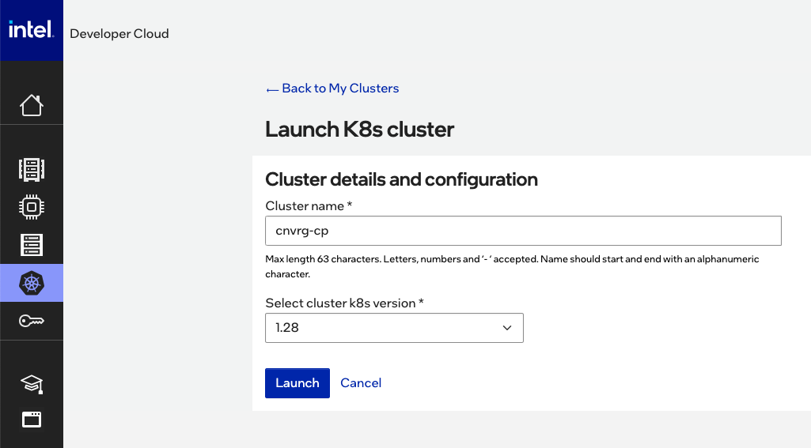
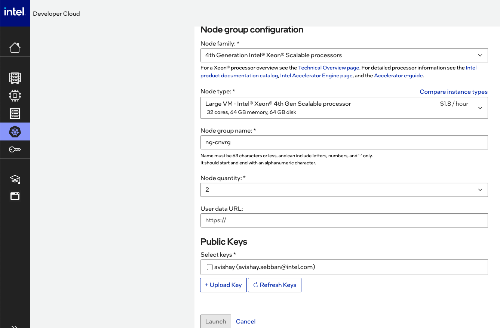
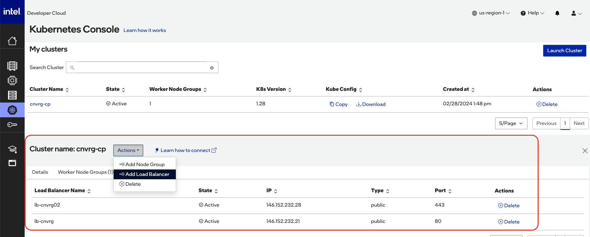
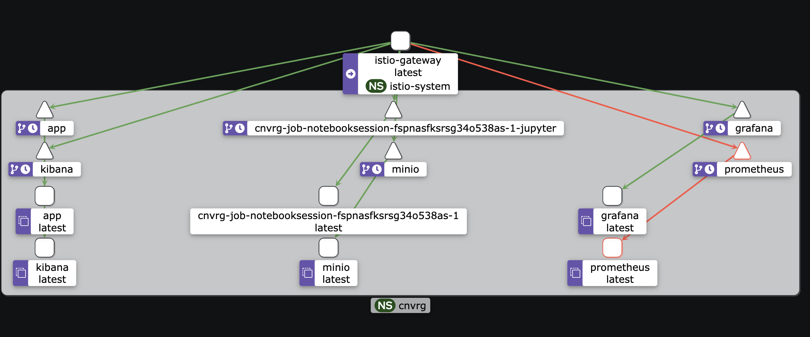

# cnvrg MLOps on Intel Cloud with Intel Kubernetes Service (IKS) 

This guide provides step-by-step instructions for deploying the cnvrg operator on Intel Developer Cloud (IDC). Follow these simple steps to get started.

## Prerequisites

- Access to [Intel Developer Cloud (IDC) console](https://intel.com/idc).
- Permissions to spin up resources and manage Kubernetes services.

## Deployment Steps

1. **Go to Intel Developer Cloud Console:**
   - Open your web browser and navigate to the [Intel Developer Cloud (IDC) console](https://console.cloud.intel.com/)).


2. **Spin Up Resources:**
   - In the IDC console, navigate to the Kubernetes service.
   - Launch a control plane cluster by following these steps:
  
     1. Provide a unique name for your cluster.
     2. Choose the desired Kubernetes version.
     3. Proceed with the default or customize advanced settings as needed.
   - Click on "Launch" to spin up the cluster.
  
3. **Add Node Group to the Cluster:**
- Navigate to the cluster settings.
- Select the option to add a new node group.
-  
    1. Choose the appropriate node type, and specify the desired quantity of nodes for the group.
    2. Confirm the selection to add the node group to the cluster.
   - Click on "Launch" and wait for node-group.
 
4. **Create Load Balancer Service:**
- Navigate to the load balancer settings.
- Create a new load balancer service.
- Configure the load balancer to open ports 80 and 443 for public network access.
- 
- Save the configuration and wait for the load balancer to be provisioned.


## Deployment step

### Istio Installation

```bash
# Add Istio Helm repository
helm repo add istio https://istio-release.storage.googleapis.com/charts

# Update Helm repositories
helm repo update

# Create namespace for Istio
kubectl create namespace istio-system

# Install Istio base components
helm install istio-base istio/base --create-namespace -n istio-system

# Install Istio control plane
helm install istiod istio/istiod --create-namespace -n istio-system

# Install Istio gateway with external IP configurations
helm install istio-gateway istio/gateway \
  --set service.externalIPs[0]=100.82.189.186 \
  --set service.externalIPs[1]=100.82.189.93 \
  --create-namespace -n istio-system

```

### Longhorn Installation
You can install Longhorn using Helm by following the steps outlined in the Longhorn [documentation.](https://longhorn.io/docs/1.6.0/deploy/install/install-with-helm/)

```bash
# Install Longhorn with specified settings
helm install longhorn longhorn/longhorn \
 --namespace longhorn-system \
 --create-namespace \
 --version 1.6.0 \
 --set defaultSettings.defaultDataPath=/mnt/longhorn
```

### DNS - The deployment necessitates integration with an external DNS service, involving the setup of A records and a wildcard DNS entry specifically designed to resolve to the K8s Ingress IP or LoadBalancer. 
For instance, a wildcard DNS record would be configured as *.cnvrg.my-org.com, directing all subdomain traffic appropriately.


### cnvrg MLOps Installation

Deploy cnvrg Operator:
   - Once the cluster is up and running, you can proceed to deploy the cnvrg operator.
   - Follow the [official documentation](https://docs.cnvrg.io/) or consult the cnvrg support team for instructions on deploying the operator on a Kubernetes cluster.
     
```bash
# Install cnvrg MLOps IDC with specified configurations
helm install cnvrg cnvrg-mlops-idc \
 --create-namespace -n cnvrg \
 --set clusterDomain=cnvrg-on-idc.azops.cnvrg.io \
 --set controlPlane.image=cnvrg/app:v4.7.52-DEV-15824-cnvrg-agnostic-infra-45 \
 --set registry.user="cnvrghelm" \
 --set registry.password="cabbecc7sd-" \
 --set networking.ingress.istioIngressSelectorKey="istio" \
 --set networking.ingress.istioIngressSelectorValue="gateway"
```



